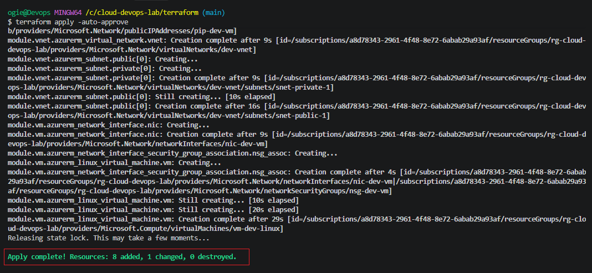
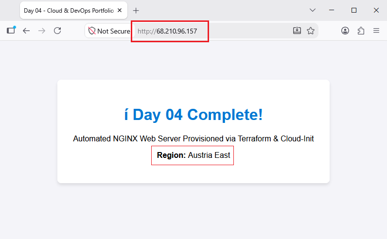
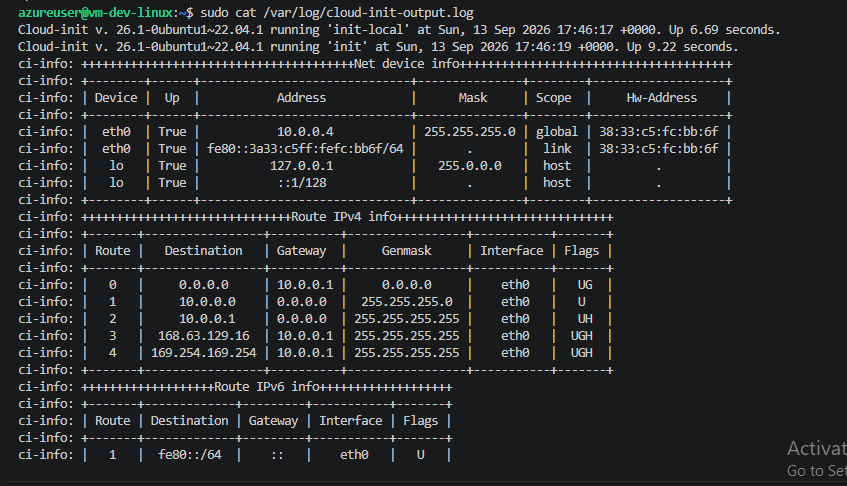

# 🚀 30-Day Cloud & DevOps Portfolio Lab

Welcome to my **30-Day Cloud & DevOps Engineering Lab**. This repository documents hands-on, production-grade infrastructure, automation pipelines, and cloud security implementations built daily on **Microsoft Azure** using **Terraform** and **DevOps best practices**.

---

## 📅 Architecture & Progress Roadmap

| Day | Topic / Focus Area | Tech Stack | Status | Documentation |
| :--- | :--- | :--- | :---: | :---: |
| **Day 01** | Modular Network Infrastructure (VNet & Subnets) | Terraform, Azure CLI | ✅ Completed | [Day 01 Docs](./terraform/README.md#day-01-modular-azure-vnet-deployment) |
| **Day 02** | Remote State Backend & Blob Storage Locks | Terraform, Azure Storage | ✅ Completed | [Day 02 Docs](./terraform/README.md#day-02-remote-state-backend--blob-storage) |
| **Day 03** | Linux Compute, SSH Keys & NSG Firewall Rules | Terraform, Azure VM, SSH | ✅ Completed | [Day 03 Docs](./terraform/README.md#day-03-linux-compute--nsg-firewall) |
| **Day 04** | Web Server Automation (NGINX & Cloud-Init) | Terraform, Cloud-Init, NGINX | ✅ Completed | [Day 04 Docs](./terraform/README.md#day-04-automated-web-server-deployment) |

---

## 🌐 Day 04: Automated Web Server Deployment (NGINX & Cloud-Init)

### Overview
Automated the installation and provisioning of an **NGINX Web Server** on Ubuntu 22.04 LTS using **Cloud-Init (`custom_data`)** during VM boot. Updated the Network Security Group to allow inbound HTTP traffic on **TCP Port 80** and deployed a custom HTML dashboard.

### Key Features
- **Zero-Touch Bootstrapping:** Injected an executable shell script via Base64 `custom_data` to automatically handle `apt` updates, package installation, and service configuration.
- **Inbound HTTP Security Rule:** Added Priority 110 rule to NSG to open Port 80 for public traffic while maintaining SSH restriction.
- **Custom Landing Page:** Configured NGINX to serve a styled HTML landing page confirming deployment parameters and region location.
- **Automated Lifecycle Integration:** Enforced Unix line endings (`LF`) and configured `terraform taint` workflows for clean, repeatable instance provisioning.

---

## 📸 Proof of Implementation

### 1. Successful apply with port 80 rule & custom_data


### 2. Live Web Server Landing Page


### 3. Cloud-Init Boot Log Execution


---

## 🛠️ Rapid Verification

```bash
# Test HTTP response headers from local terminal
curl -I http://<VM_PUBLIC_IP>

# Fetch custom HTML landing page
curl http://<VM_PUBLIC_IP>
