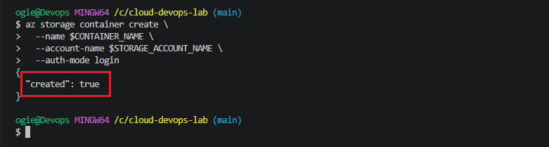
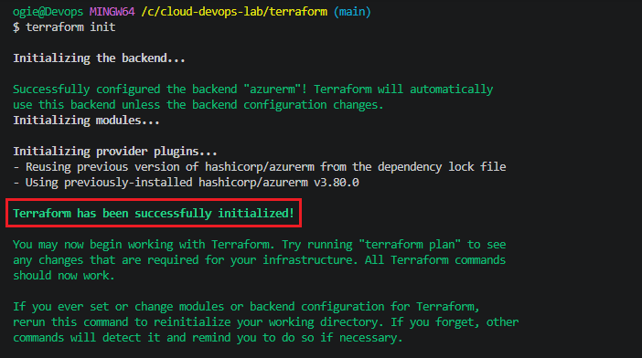
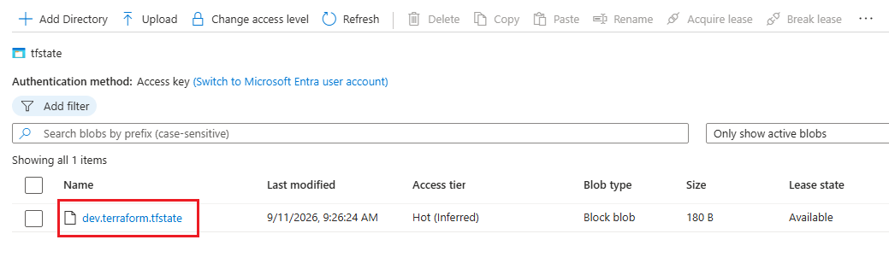

# 🚀 30-Day Cloud & DevOps Portfolio Lab

Welcome to my **30-Day Cloud & DevOps Engineering Lab**. This repository documents hands-on, production-grade infrastructure, automation pipelines, and cloud security implementations built daily on **Microsoft Azure**.

---

## 📅 Architecture & Progress Roadmap

| Day | Topic / Focus Area | Tech Stack | Status | Documentation |
| :--- | :--- | :--- | :---: | :---: |
| **Day 01** | Modular Network Infrastructure (VNet & Subnets) | Terraform, Azure CLI | ✅ Completed | [Day 01 Docs](./terraform/README.md#day-01-modular-azure-vnet-deployment) |
| **Day 02** | Remote State Backend & Blob Storage Locks | Terraform, Azure Storage | ✅ Completed | [Day 02 Docs](./terraform/README.md#day-02-remote-state-backend--blob-storage) |
| **Day 03** | Linux Compute, SSH Keys & NSG Firewall Rules | Terraform, Azure VM | 📅 Pending | Upcoming |

---

## 🏗️ Day 02: Remote State & Blob Storage Locks

### Overview
Migrated local Terraform state files (`terraform.tfstate`) to a secure, centralized **Azure Blob Storage Backend**. Enabled automated state locking using Azure Blob leases to prevent concurrent execution conflicts in collaborative DevOps environments.

### Key Highlights
- **State Security:** Removed local state files to eliminate plaintext secret exposure in local workspaces.
- **Concurrency Control:** Automated state locking via Azure Blob leases during `terraform plan` and `terraform apply`.
- **Policy Compliance:** Provisioned storage resources in `italynorth` to align with Azure for Students tenant policy guardrails.

---

## 📸 Proof of Implementation

### 1. Storage Account & Container Provisioning


### 2. Terraform Backend Migration (`terraform init`)


### 3. Azure Portal — Remote State Blob Container


---

## 🛠️ Getting Started

### Prerequisites
- [Azure CLI](https://docs.microsoft.com/en-us/cli/azure/install-azure-cli) `v2.50.0+`
- [Terraform CLI](https://developer.hashicorp.com/terraform/downloads) `v1.5.0+`

### Quickstart Execution
```bash
# Clone Repository
git clone [https://github.com/blessador/cloud-devops-lab.git](https://github.com/blessador/cloud-devops-lab.git)
cd cloud-devops-lab/terraform

# Authenticate & Set Active Subscription
az login
export ARM_SUBSCRIPTION_ID=$(az account show --query id -o tsv)

# Initialize Remote Backend & Deploy
terraform init
terraform plan -out=tfplan
terraform apply tfplan
