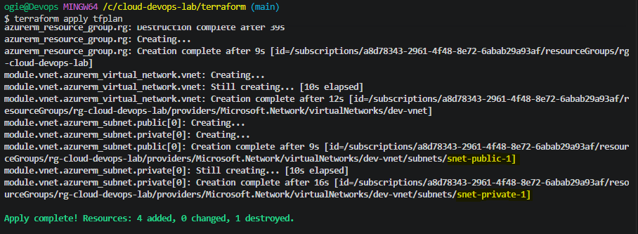
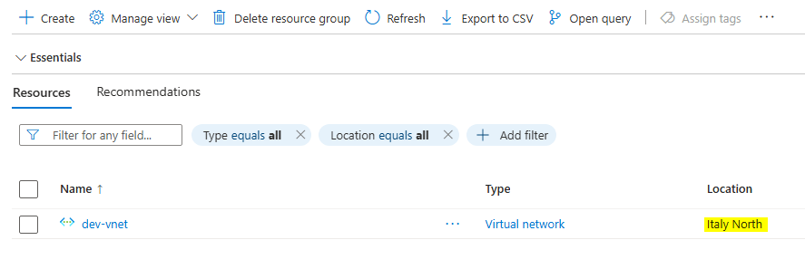
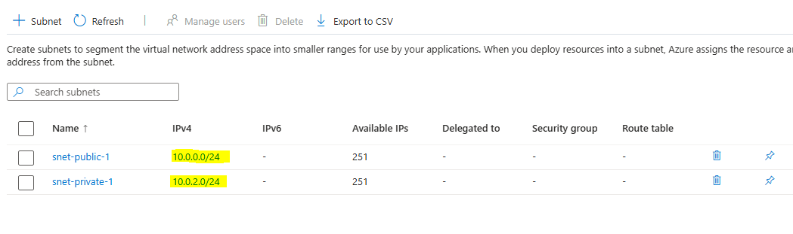

# 🚀 30-Day Cloud & DevOps Portfolio Lab

Welcome to my **30-Day Cloud & DevOps Engineering Lab**. This repository documents hands-on, production-grade infrastructure, automation pipelines, and cloud security implementations built daily on **Microsoft Azure**.

---

## 📅 Architecture & Progress Roadmap

| Day | Topic / Focus Area | Tech Stack | Status | Documentation |
| :--- | :--- | :--- | :---: | :---: |
| **Day 01** | Modular Network Infrastructure (VNet & Subnets) | Terraform, Azure CLI | ✅ Completed | [Day 01 Docs](./terraform/README.md) |
| **Day 02** | Remote State Backend & Blob Storage Locks | Terraform, Azure Storage | ⏳ Next | Upcoming |
| **Day 03** | Linux Compute, SSH Keys & NSG Firewall Rules | Terraform, Azure VM | 📅 Pending | Upcoming |

---

## 🏗️ Day 01: Modular Azure VNet Deployment

### Overview
Automated the core virtual network foundation using modular **Terraform (Infrastructure as Code)** within an enterprise-restricted Azure tenant. 

### Key Features
- **Strict Region Policy Compliance:** Deployed to `italynorth` to align with organizational allowed-region policies.
- **Modular Terraform Design:** Reusable local module structure for VNet and Subnet isolation.
- **Subnet Segmentation:** Separated workload layers into public (`10.0.0.0/24`) and private (`10.0.2.0/24`) subnets.

### Deployed Architecture
- **Resource Group:** `rg-cloud-devops-lab` (`italynorth`)
- **Virtual Network:** `dev-vnet` (`10.0.0.0/16`)
- **Subnets:**
  - `snet-public-1` (`10.0.0.0/24`)
  - `snet-private-1` (`10.0.2.0/24`)

---

## 📸 Proof of Implementation

### 1. Terraform Execution Output


### 2. Azure Resource Group Overview


### 3. Subnets Configuration


---

## 🛠️ Getting Started

### Prerequisites
- [Azure CLI](https://docs.microsoft.com/en-us/cli/azure/install-azure-cli) `v2.50.0+`
- [Terraform CLI](https://developer.hashicorp.com/terraform/downloads) `v1.5.0+`

### Quickstart Execution
```bash
# Clone Repository
git clone [https://github.com/blessador/cloud-devops-lab.git](https://github.com/blessador/cloud-devops-lab.git)
cd cloud-devops-lab/terraform

# Authenticate with Azure CLI
az login

# Set Active Subscription
export ARM_SUBSCRIPTION_ID=$(az account show --query id -o tsv)

# Initialize & Deploy Infrastructure
terraform init
terraform plan -out=tfplan
terraform apply tfplan
