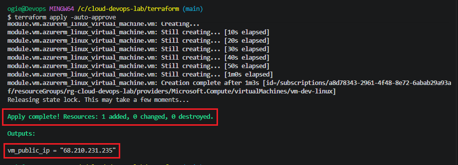
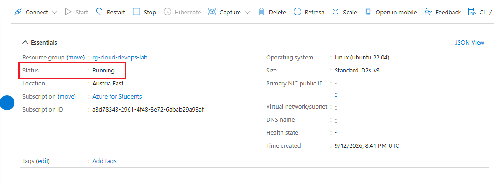
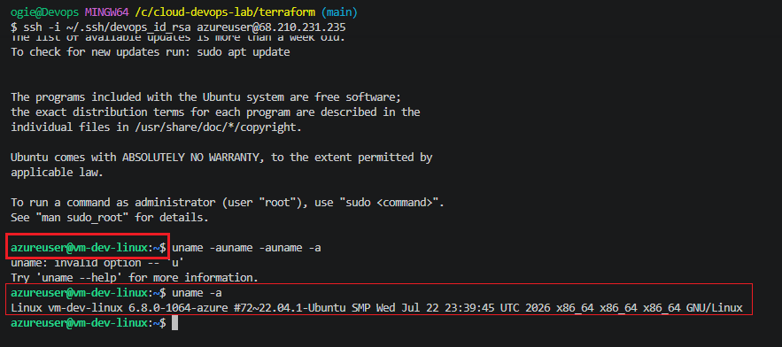

# 🚀 30-Day Cloud & DevOps Portfolio Lab

Welcome to my **30-Day Cloud & DevOps Engineering Lab**. This repository documents hands-on, production-grade infrastructure, automation pipelines, and cloud security implementations built daily on **Microsoft Azure**.

---

## 📅 Architecture & Progress Roadmap

| Day | Topic / Focus Area | Tech Stack | Status | Documentation |
| :--- | :--- | :--- | :---: | :---: |
| **Day 01** | Modular Network Infrastructure (VNet & Subnets) | Terraform, Azure CLI | ✅ Completed | [Day 01 Docs](./terraform/README.md#day-01-modular-azure-vnet-deployment) |
| **Day 02** | Remote State Backend & Blob Storage Locks | Terraform, Azure Storage | ✅ Completed | [Day 02 Docs](./terraform/README.md#day-02-remote-state-backend--blob-storage) |
| **Day 03** | Linux Compute, SSH Keys & NSG Firewall Rules | Terraform, Azure VM, SSH | ✅ Completed | [Day 03 Docs](./terraform/README.md#day-03-linux-compute--nsg-firewall) |
| **Day 04** | Web Server Automation (NGINX & Cloud-Init) | Terraform, Cloud-Init, NGINX | 📅 Pending | Upcoming |

---

## 🏗️ Day 03: Linux Compute & Network Security Groups

### Overview
Provisioned an **Ubuntu 22.04 LTS Linux Virtual Machine** inside the public subnet (`snet-public-1`) in `austriaeast`, secured via an **Azure Network Security Group (NSG)** and public key SSH authentication.

### Key Features
- **Public Key Authentication:** Disabled password authentication in favor of 4096-bit RSA SSH keys (`devops_id_rsa`).
- **Firewall Isolation:** Attached NSG restricting inbound network traffic exclusively to SSH (`TCP/22`).
- **Standard Public IP:** Dynamic/Standard SKU Public IP association for remote administration.
- **Resilient Compute Sizing:** Deployed `Standard_D2s_v3` VM size to navigate regional SKU quota constraints on Azure for Students.

---

## 📸 Proof of Implementation

### 1. Terraform Deployment Execution


### 2. Azure Virtual Machine Portal Overview


### 3. Remote SSH Terminal Connection


---

## 🛠️ Getting Started

```bash
# SSH into deployed VM
ssh -i ~/.ssh/devops_id_rsa azureuser@<VM_PUBLIC_IP>